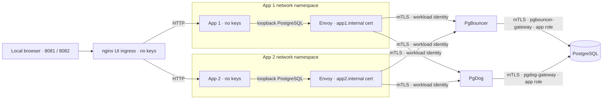

# Passwordless PostgreSQL pooler lab

Two web apps demonstrate certificate-to-role authorization through **PgBouncer 1.25.2** and **PgDog 0.1.59**, both connected to the same **PostgreSQL 17.11** database. Each app gets its own identity and schema, with buttons for successful queries and deliberate authorization failures.

The apps supply a PostgreSQL username without a password. An app-local Envoy sidecar holds its workload certificate. The pooler checks that certificate against the requested role, then connects to PostgreSQL using its own gateway certificate while retaining the application's database role.

## Run

Requirements: Docker with the Docker Compose v2 plugin, a running Docker daemon, and internet access for the initial image/build downloads. `make test` also requires Make and Python 3 on the host; its host scripts use only the standard library. No host PostgreSQL, certificates, or database credentials are needed.

```sh
docker compose up --build -d --wait
make test
```

Open both interfaces:

- [App 1 — localhost:8081](http://localhost:8081)
- [App 2 — localhost:8082](http://localhost:8082)

Select PgBouncer or PgDog, check the identity, read/write a note, and run the denial probes. `make test` is the verification entry point; container startup and `/healthz` alone do not prove that authentication works.

Only these two HTTP ports are published, bound to host loopback through a small nginx `ui` ingress. The apps and Envoys stay on internal networks. Use `.env.example` if you need different UI ports or a backend subnet that does not overlap your existing Docker/VPN networks.

## What to expect

| Attempt, through either pooler | Expected result |
| --- | --- |
| App 1 reads/writes `app1.notes` | Allowed as `app1` |
| App 2 reads/writes `app2.notes` | Allowed as `app2` |
| App 1 requests role `app2`, or the reverse | Blocked by certificate-to-role mapping |
| An app reads the other schema or uses `SET ROLE` | Blocked by PostgreSQL privileges |
| An app bypasses Envoy with plaintext or no client certificate | Blocked by pooler authentication |
| An app connects directly to PostgreSQL, by name and numeric IP | Unreachable from its network namespace |

The evidence panel shows actual query results, errors, SQLSTATEs, and the TLS session PostgreSQL sees. Its client certificate is `pgbouncer-gateway` or `pgdog-gateway`. **The original workload certificate is not forwarded to PostgreSQL.** Both `current_user` and `session_user` remain the authorized app role.

PgDog 0.1.59 requires a non-secret `server_password=""` configuration entry to attempt a backend connection; PostgreSQL still authenticates it by certificate and has no usable role passwords. The [manual explains this version-specific detail](docs/IMPLEMENTATION.md#pgdog-authorization).



The poolers are alternative paths, not a chain. Each runs transaction pooling against one database; the lab makes no sharding or high-availability claim.

## Observe and stop

The UI's last 100 events are real application attempts, held in memory separately by each app. They are not a combined service-log viewer. Raw service logs are available without giving the apps access to Docker:

```sh
docker compose logs --tail=100 ui envoy-app1 envoy-app2 pgbouncer pgdog postgres
docker compose down
```

`down` preserves certificates and notes in Docker volumes. Local leaf certificates expire after 30 days; restarting does not renew them.

To **destroy all demo data and certificate material** and start fresh:

```sh
docker compose down --volumes --remove-orphans
docker compose up --build -d --wait
make test
```

## Read before adapting

- [Implementation manual](docs/IMPLEMENTATION.md): setup, exact trust/role mappings, config, API, lifecycle, tests, troubleshooting, and extension instructions.
- [Security model](docs/SECURITY.md): authentication, authorization, network isolation, expected negative tests, and limits.
- [Verification record](docs/VERIFICATION.md): observed test results, fresh initialization, browser checks, and audit scope.
- [Agent instructions](AGENTS.md): source map and invariants for further implementation.

This is a local demonstrator. Envoy's PostgreSQL filter is a contrib extension that upstream explicitly describes as not hardened. Its limitations matter even when all demo checks pass. See the [versioned Envoy documentation](https://www.envoyproxy.io/docs/envoy/v1.39.1/api-v3/extensions/filters/network/postgres_proxy/v3alpha/postgres_proxy.proto).
