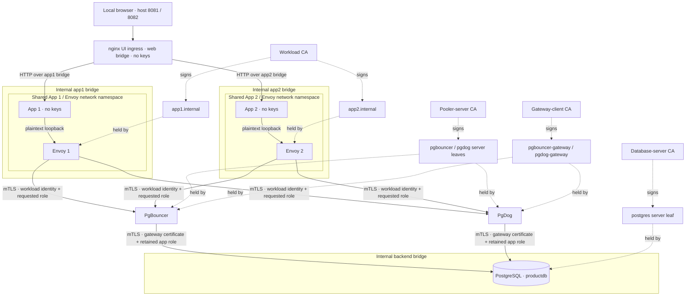

# Implementation manual

This repository implements a local, runnable demonstration of delegated PostgreSQL identity. Two application instances select either PgBouncer or PgDog and reach the same PostgreSQL database without an application password or certificate/private-key mount. The sidecar authenticates the workload, the pooler authorizes its requested role, and PostgreSQL applies that role's SQL privileges.

Use this document as an implementation and maintenance guide. Configuration and tests in the repository are authoritative. Expected results below describe acceptance criteria; they are not a claim that a particular checkout has already passed on your machine.

## 1. Start from a clean checkout

Install Docker with Compose v2 and start the daemon. Make and host Python 3 are needed for `make test`; the host test scripts use only the standard library, while unit tests run in a built container. Initial builds need network access to the registries, Debian package repositories, PyPI, and the PgBouncer release download. Runtime app and database networks are internal Docker bridges.

From the repository root:

```sh
docker compose config --quiet
docker compose up --build -d --wait
make test
```

Open [App 1](http://localhost:8081) and [App 2](http://localhost:8082). Both serve the same UI, with identity supplied by their own environment. Switch the pooler in each UI and run the available actions. Writes persist in the corresponding schema and are visible through either pooler.

The one-shot `pki` container exiting with code zero is normal. PostgreSQL's healthcheck verifies that the app roles have been initialized. The app healthchecks only check HTTP liveness. PgBouncer and PgDog starting, or `docker compose up --wait` completing, does not replace the live authentication tests.

The configurable host values are:

| Variable | Default | Meaning |
| --- | --- | --- |
| `APP1_PORT` | `8081` | Host loopback port for App 1 |
| `APP2_PORT` | `8082` | Host loopback port for App 2 |
| `BACKEND_SUBNET` | `172.30.83.0/24` | Internal backend network subnet |
| `DIRECT_DB_IP` | `172.30.83.10` | PostgreSQL address, also used by numeric isolation probes |

Copy `.env.example` to `.env` to change these. Keep `DIRECT_DB_IP` inside `BACKEND_SUBNET`; avoid existing host, VPN, and Docker ranges. It must identify the actual PostgreSQL container. A probe aimed at an unrelated address cannot establish database isolation.

## 2. Processes, ports, and boundaries

| Service | Responsibility | Network membership | Credential mount |
| --- | --- | --- | --- |
| `ui` | nginx ingress exposing the two local HTTP interfaces | `web`, `app1`, `app2`; no backend | None |
| `pki` | Generate local CAs, leaf credentials, and test fixtures once | None | All PKI output volumes and private CA volume |
| `app1` | HTTP UI/API; fixed SQL and reachability probes | Shares `envoy-app1` network namespace | None |
| `app2` | Same application with App 2 identity | Shares `envoy-app2` network namespace | None |
| `envoy-app1` | Originate mTLS with App 1 workload identity | `app1` bridge | App 1 leaf and pooler CA |
| `envoy-app2` | Originate mTLS with App 2 workload identity | `app2` bridge | App 2 leaf and pooler CA |
| `pgbouncer` | Certificate authorization and transaction pooling | `app1`, `app2`, `backend` | Server leaf, gateway leaf, workload/database CAs |
| `pgdog` | Certificate authorization and transaction pooling | `app1`, `app2`, `backend` | Server leaf, gateway leaf, workload/database CAs |
| `postgres` | App role enforcement and persistent notes | `backend` only | Database server leaf and gateway CA |
| `security-tests` | Privileged one-shot adversarial checks | All three bridges, test profile only | Dedicated test fixture volume |

The apps use `network_mode: service:envoy-appN`, sharing network interfaces and loopback with their own Envoy. They do not share Envoy's filesystem mounts. Envoy listens only at `127.0.0.1:15432` for PgBouncer and `127.0.0.1:15433` for PgDog. No Envoy admin endpoint is configured.

The HTTP process listens on namespace port `8080`. The `ui` nginx service listens on `8081` and `8082`, forwarding HTTP respectively to `envoy-app1:8080` and `envoy-app2:8080`, where the namespace-sharing apps answer. Only nginx publishes host `127.0.0.1:8081` and `127.0.0.1:8082`. It preserves the browser Host header and resolves the fixed upstream names through Docker DNS so recreated app namespaces remain reachable. The poolers listen on `6432` on their container networks; PostgreSQL listens on backend port `5432`. None of those database/proxy ports is host-published.

The `app1`, `app2`, and `backend` bridges use `internal: true`. Separate bridge membership keeps apps off the backend; PostgreSQL is not an app-network DNS service. Isolation is verified with both its name and fixed numeric IP. Docker's network controls and the host are part of this trust boundary.

The fourth bridge, `web`, is an ordinary bridge joined only by nginx. It provides a host-publication path because Docker internal-only networking did not provide working host port publication in the implementation environment. The apps and Envoys retain internal-only networking. nginx has no backend membership or certificate mounts, runs nonroot with dropped capabilities and a read-only root, and proxies only the two fixed HTTP destinations. It is a trusted shared ingress with access to both application HTTP interfaces; it does not authenticate individual UI users.



The poolers join both app bridges and the backend bridge. nginx joins the web bridge and both app bridges. The diagram separates the two TLS hops; it does not depict forwarding the original certificate to PostgreSQL.

## 3. Certificate provisioning and key ownership

`docker/pki/generate.py` uses `cryptography` to generate ECDSA P-256 keys. Four separate runtime CAs provide distinct trust domains; a fifth, rogue CA is only for denial tests.

| CA directory in private volume | Leaves | Verified by |
| --- | --- | --- |
| `workload` | `app1.internal`, `app2.internal` | Both poolers |
| `pooler` | `pgbouncer`, `pgdog` | Both Envoys |
| `gateway` | `pgbouncer-gateway`, `pgdog-gateway` | PostgreSQL |
| `database` | `postgres` | Both poolers |
| `rogue` | Untrusted App 1 test leaf | No runtime service |

Each leaf has the same DNS SAN and CN, plus a client-auth or server-auth extended key usage matching its purpose. Runtime leaf certificates last 30 days; local roots last 365 days. The expired test leaf is deliberately already expired. An `unmapped.internal` leaf has a trusted issuer but no authorized app identity.

CA signing keys reside only in `ca-private`, mounted to the offline `pki` init container. Runtime services get individual named volumes with the leaves and public roots they need. Private key files use mode `0600`; service keys are owned by UID 10001, and PostgreSQL keys by UID 999. Public certificates use `0644`. Runtime mounts are read-only. No PKI material is generated into the Git checkout.

The privileged `test-tls` fixture contains copies of valid workload/gateway keys and deliberately invalid leaves. It is mounted only to the profile-gated test service. Do not attach that service or volume to an application deployment: its purpose is to bypass normal network boundaries and test the next layer directly.

Provisioning reuses existing CA and leaf files. It does not renew expired certificates or implement online rotation, revocation, or secret distribution. A normal rebuild/restart preserves them. For a disposable lab, the destructive full reset in section 9 regenerates them along with the database.

## 4. Follow a successful connection

### App to Envoy

The app connects with a requested role (`app1` or `app2`), database `productdb`, `sslmode=disable`, and `passfile=/dev/null`. It provides neither a password nor a certificate/key path. Plain PostgreSQL traffic stays on namespace loopback. Envoy chooses the upstream based on the listener port, not on input supplied through the HTTP API.

### Envoy to pooler

`config/envoy/envoy.yaml` chains `envoy.filters.network.postgres_proxy` before the TCP proxy. The PostgreSQL filter is necessary for PostgreSQL's SSL negotiation: `upstream_ssl: REQUIRE` requests the protocol's TLS upgrade, and the cluster uses `UpstreamStartTlsConfig` to perform it. A plain immediate-TLS TCP proxy is not a substitute for that configuration. SQL parsing is disabled.

Each cluster loads the local workload leaf/key, trusts only the pooler-server CA, sends SNI `pgbouncer` or `pgdog`, and requires that exact DNS SAN. A pooler refusal to upgrade cannot silently downgrade this path. These semantics and the contrib/non-hardened limitation are documented in the [Envoy 1.39.1 PostgreSQL filter API](https://www.envoyproxy.io/docs/envoy/v1.39.1/api-v3/extensions/filters/network/postgres_proxy/v3alpha/postgres_proxy.proto).

### PgBouncer authorization

`config/pgbouncer/pgbouncer.ini` uses `auth_type=hba` with a certificate HBA rule:

```text
hostssl productdb app1,app2 all cert map=workloads
host all all all reject
local all all reject
```

`pg_ident.conf` contains exactly:

```text
workloads app1.internal app1
workloads app2.internal app2
```

The frontend TLS config verifies workload certificate chains with `client_tls_sslmode=verify-ca`; the `cert` authentication rule and map enforce the CN-to-requested-role relationship. Chain validation alone would not establish which role the client may request. `userlist.txt` declares the two users with empty password fields; these fields are not password authentication grants.

The `productdb` connection string has no forced `user=`. PgBouncer therefore retains the authenticated app role for backend login. `server_tls_sslmode=verify-full`, `database-ca.crt`, and the `pgbouncer-gateway` keypair provide the backend TLS configuration. See [PgBouncer's authentication, identity-map, and TLS configuration reference](https://www.pgbouncer.org/config.html).

### PgDog authorization

`config/pgdog/pgdog.toml` enables frontend TLS, trusts the workload CA, and sets `tls_client_required=true`. Each `users.toml` entry pins the database, role, identity, and certificate requirement:

```toml
[[users]]
name = "app1"
database = "productdb"
identity = "app1.internal"
tls_client_certificate_required = true
server_password = ""
```

App 2 has the equivalent entry with `app2` and `app2.internal`. In pinned PgDog v0.1.59, identity extraction prefers the first DNS SAN and falls back to CN. The frontend checks that identity against the configured user. The generated certs put the same identity in both fields. See the version-tagged [TLS source](https://github.com/pgdogdev/pgdog/blob/v0.1.59/pgdog/src/net/tls.rs) and [frontend authentication source](https://github.com/pgdogdev/pgdog/blob/v0.1.59/pgdog/src/frontend/client/mod.rs).

`auth_type="scram"` is the configured fallback, not the authentication path used by these users. Their mandatory certificate identity satisfies authentication without a password; no user password is configured, and `passthrough_auth="disabled"`. Keep the per-user certificate requirement: configuring a CA alone does not express this authorization policy. The pinned configuration definitions are in [general.rs](https://github.com/pgdogdev/pgdog/blob/v0.1.59/pgdog-config/src/general.rs) and [users.rs](https://github.com/pgdogdev/pgdog/blob/v0.1.59/pgdog-config/src/users.rs).

**Correction to the initial proposed configuration:** each PgDog user needs `server_password=""` in this pinned release. `Address::auth_credentials()` constructs backend connection candidates from configured password fields; `Server::connect()` iterates those candidates. With no configured candidate, v0.1.59 returns an authentication error before opening a backend connection. The empty string supplies one candidate and permits the TLS/certificate connection attempt. It is not a usable database password: PostgreSQL's app roles have NULL passwords and the HBA policy accepts certificate authentication only. Do not replace it with a real secret. See the version-tagged [backend address code](https://github.com/pgdogdev/pgdog/blob/v0.1.59/pgdog/src/backend/pool/address.rs) and [backend connection code](https://github.com/pgdogdev/pgdog/blob/v0.1.59/pgdog/src/backend/server.rs).

PgDog also has a separate virtual administration path. This demo does not configure fixed admin credentials; the pinned server generates a random admin password at startup. That path is separate from app certificate identities and is not claimed to use certificate-only administration. Do not introduce a default/shared admin password or publish its listener to the host.

On the backend, `tls_verify="verify_full"` verifies the PostgreSQL server using the database CA and hostname. `tls_server_certificate` and `tls_server_private_key` select the `pgdog-gateway` client identity. There is no replacement backend username. The single configured database is `productdb` on primary `postgres:5432`.

### Pooler to PostgreSQL

The TLS connection to PostgreSQL is a new session. PostgreSQL authenticates the pooler's gateway certificate, with this HBA rule:

```text
hostssl productdb app1,app2 all cert map=gateways
host all all all reject
```

The `gateways` map permits each gateway CN to request either app role:

```text
gateways pgbouncer-gateway app1
gateways pgbouncer-gateway app2
gateways pgdog-gateway app1
gateways pgdog-gateway app2
```

PostgreSQL trusts only the gateway CA for client certificates. It does not trust workload certificates as database client identities. Its certificate auth checks the CN against the requested role through this map; see [PostgreSQL 17 certificate authentication](https://www.postgresql.org/docs/17/auth-cert.html).

This is deliberate delegation. A gateway is authorized for both app roles and must enforce workload-to-role authorization correctly. PostgreSQL can verify which gateway connected and which role it requested; it cannot independently recover the original app certificate. Compromising a pooler can expose both app roles.

## 5. SQL roles and data

`config/postgres/init.sql` initializes:

| Role | Login and privileges |
| --- | --- |
| `postgres` | Local OS-user peer administration; no password; rejected on TCP |
| `demo_owner` | `NOLOGIN`; owns both schemas and tables |
| `app1` | Passwordless login; connect to `productdb`; schema `app1` usage and note SELECT/INSERT |
| `app2` | Passwordless login; connect to `productdb`; schema `app2` usage and note SELECT/INSERT |

The app roles are not superusers, database creators, role creators, replication users, or RLS bypass users. They have no membership in one another or `demo_owner`. Public database privileges and public-schema privileges are revoked. Both apps have sequence usage for their own generated note IDs, and a role-level statement timeout.

Each schema has the same table:

```sql
CREATE TABLE app1.notes (
    id bigint GENERATED ALWAYS AS IDENTITY PRIMARY KEY,
    body text NOT NULL,
    created_at timestamptz NOT NULL DEFAULT now()
);
```

There is no row-level-security claim: schema/table grants are the authorization mechanism. Apps may SELECT and INSERT their own notes; UPDATE, DELETE, DDL, cross-schema access, and assuming the other role are not granted.

The official PostgreSQL image needs a nonempty bootstrap password on first initialization. The offline PKI job creates a random local bootstrap file for that purpose. The first SQL initialization statement is `ALTER ROLE postgres PASSWORD NULL`, removing the password from the role. The bootstrap file remains in the PostgreSQL TLS volume, but no TCP HBA rule enables password authentication, and neither app receives it. Local maintenance uses `peer`, not a shared database password.

Initialization SQL runs only on a fresh database volume. Editing `init.sql` does not migrate an existing database. Use an explicit migration, or intentionally reset this disposable demo.

## 6. Application API and evidence

The app's role, other role, and numeric database address come from fixed environment settings validated at startup. HTTP callers may choose only a known pooler and a named action. Unknown fields, arbitrary SQL, supplied credentials, alternative hosts, and arbitrary roles are rejected.

| Endpoint | Purpose |
| --- | --- |
| `GET /healthz` | Process liveness, without testing the database |
| `GET /api/config` | This app's metadata, pooler choices, actions, and event limit |
| `POST /api/run` | Execute one fixed action |
| `GET /api/events` | Last 100 actual attempts for this app process |

Example:

```sh
curl --fail-with-body http://localhost:8081/api/run \
  -H 'Content-Type: application/json' \
  -d '{"pooler":"pgbouncer","action":"identity"}'
```

| Action | Intended check | Expected outcome |
| --- | --- | --- |
| `identity` | Read the backend role, database, and TLS evidence | `allowed` |
| `read` | SELECT the newest notes in this app's schema | `allowed` |
| `write` | INSERT a server-generated note in this app's schema | `allowed` |
| `impersonate` | Keep the workload certificate but request the other role | `blocked` |
| `cross_read` | SELECT the other schema under the correct role | `blocked` |
| `set_role` | Request the other role after a valid login | `blocked` |
| `direct_db` | Probe `postgres:5432` and its configured numeric address | `blocked` |
| `direct_pooler_plain` | Connect directly to the pooler without TLS | `blocked` |
| `direct_pooler_tls` | Connect directly using TLS without a client certificate | `blocked` |

Every response includes request ID, timestamp, app, pooler, action, expected/actual outcome, `passed`, elapsed time, and evidence. An expected denial is a successful security check; an outage is `error`. Unauthorized success or a wrong backend role/TLS identity is `unexpected`. HTTP 200 means the probe ran: consumers must check `passed`, rather than treating an HTTP status as the security result.

SQL actions run in explicit transactions so their identity, TLS observation, and statement use the same checked-out backend. Evidence comes from the current session's `pg_stat_ssl` row and SQL functions, including `current_user`, `session_user`, `pg_backend_pid()`, and `inet_server_addr()`. PostgreSQL 17 reports the subject in this lab as `/CN=pgbouncer-gateway` or `/CN=pgdog-gateway`. This establishes the pooler-to-database TLS hop. Envoy transport logs provide evidence about the earlier hop.

The direct-pooler TLS negative probe uses `sslmode=require` without a CA or key mount. Its sole purpose is to test refusal of a missing client certificate. It is not a demonstration of server hostname verification; the normal Envoy path is configured to perform that check.

SQL privilege denials must have SQLSTATE `42501`; login/TLS probes use their applicable authentication states or specific certificate/TLS errors. Generic EOF, connection refusal, timeout, or a missing table must not be accepted as an authorization denial. Negative app probes include a successful identity control through the selected pooler. Direct database probes require numeric isolation plus a healthy control, so failed DNS or a stopped database cannot produce a passing isolation result.

The UI feed and `/api/events` contain real app attempts and reset when that app restarts. They do not contain all Envoy, pooler, or PostgreSQL logs. No Docker socket is mounted to any app.

POSTs require JSON; the app rejects mismatched browser Origin, cross-site Fetch Metadata, and unknown Host values. CSP and response headers constrain the page. These are protections for a localhost demo, not a multi-user HTTP authentication system.

## 7. Verification workflow

Run `make test` after the stack is up. It runs containerized unit tests, the privileged live certificate suite, API actions against the two published interfaces, and checks of the running Docker deployment. The component targets are `make unit`, `make security`, `make api`, and `make deployment`. For the isolated pooler/backend adversarial suite:

```sh
docker compose --profile test run --rm security-tests
```

`tests/test_app.py` checks fixed input validation, browser request protections, bounded event feeds, error classification, successful controls, numeric probes, and role/TLS evidence. It substitutes external I/O to isolate application behavior.

`tests/security.py` uses real connections with controlled certificate fixtures to check both roles through both poolers; wrong-role login; plaintext and missing certificates; expired, rogue, and unmapped certificates; SQL privilege denials; gateway-only backend access; unauthorized database names; and concurrent role preservation. The test container intentionally has backend access so these checks exercise database authentication rather than Docker isolation.

`tests/api_integration.py` exercises all nine actions for both apps and both poolers, checking outcomes and each app's event feed. It discovers effective UI ports from `docker compose port`, including `.env` overrides. `tests/deployment.py` inspects running containers/networks and PostgreSQL roles to verify credential-free app mounts, namespace sharing, loopback publication, network separation, NULL role passwords, and absence of privilege memberships. CI boots the stack, runs `make test`, and captures service logs for failed runs.

Live API checks must run all UI actions for both apps and both poolers. Direct database isolation must run from each app namespace, not from the privileged security-test container. Keep availability controls when adding denials. The security matrix in [SECURITY.md](SECURITY.md) records which layer each check exercises.

To inspect the initialized privilege state without exposing a TCP administrator:

```sh
docker compose exec -u postgres postgres psql -d productdb -c '\du'
docker compose exec -u postgres postgres psql -d productdb -c '\dp app1.*'
docker compose exec -u postgres postgres psql -d productdb -c '\dp app2.*'
docker compose exec -u postgres postgres psql -d productdb -c \
  "SELECT rolname, rolpassword IS NULL AS has_no_password FROM pg_authid WHERE rolname IN ('postgres','app1','app2');"
```

That final query emits a boolean, not the password column. Do not dump private-key files or fixture volumes into logs or bug reports.

## 8. Logs and troubleshooting

```sh
docker compose ps --all
docker compose logs --tail=100 pki postgres pgbouncer pgdog
docker compose logs --tail=100 ui envoy-app1 envoy-app2 app1 app2
```

| Symptom | Check and response |
| --- | --- |
| Build or pull fails | Inspect registry/package connectivity and platform compatibility; preserve version pins while diagnosing |
| Port already allocated | Change the relevant `APP1_PORT`/`APP2_PORT` in `.env` |
| Apps are healthy but host UIs do not answer | Check the `ui` service and its ordinary `web` bridge; HTTP publication belongs to nginx, not the internal-only Envoys |
| Backend network overlaps an existing network | Choose a different `BACKEND_SUBNET` and matching `DIRECT_DB_IP`, then recreate the stack |
| `pki` exited successfully | Expected one-shot completion; other services consume its generated volumes |
| PostgreSQL unhealthy | Check certificate permissions and init logs; partial first initialization may require an intentional demo reset |
| App is healthy but queries fail | `/healthz` is liveness only; check pooler, Envoy, and PostgreSQL logs and run an identity probe |
| PgDog frontend accepts identity but cannot open backend | Confirm each user retains `server_password=""`; v0.1.59 needs the empty candidate to attempt certificate-authenticated backend login |
| Valid identity fails after time away | Inspect leaf expiration; idempotent provisioning does not renew 30-day certs |
| Wrong certificate or role denied | Compare issuer, CN/SAN, requested role, and database with both mappings; do not weaken TLS/auth rules |
| Config changes appear ineffective | Restart/recreate the affected service; SQL initialization needs a migration or fresh database volume |
| Direct DB DNS fails | Expected because the app is off the backend network; also inspect the numeric probe and healthy control |
| Direct DB numeric probe becomes reachable | Treat as a failed security check; inspect network membership, Docker rules, and the configured target address |
| A denial is reported as `error` | Preserve the raw error and successful control; investigate rather than widening the classifier to all exceptions |

## 9. Lifecycle and reset

Stop without deleting notes or PKI:

```sh
docker compose down
```

Start the existing volumes again:

```sh
docker compose up --build -d --wait
make test
```

**Destructive demo reset:** this deletes all Compose-managed named volumes, including notes, private CA keys, all leaf keys, and test fixtures. Use only when that loss is intended.

```sh
docker compose down --volumes --remove-orphans
docker compose up --build -d --wait
make test
```

Partial deletion of PKI volumes can leave mismatched issuers, leaves, or trust roots. This demo does not provide a safe online rotation procedure. Do not describe a restart or full reset as production certificate rotation.

## 10. Source map and agent extension checklist

| Path | Owns |
| --- | --- |
| `compose.yaml` | Service dependencies, credential mounts, network boundaries, host ports, version/image pins |
| `docker/pki/generate.py` | CA domains, certificate names/purposes/lifetimes, ownership, invalid test fixtures |
| `docker/pgbouncer/Dockerfile` | PgBouncer 1.25.2 source build and release checksum |
| `config/envoy/envoy.yaml` | Loopback listeners, PostgreSQL STARTTLS, upstream server verification |
| `config/nginx.conf` | Fixed HTTP ingress routes, Host preservation, Docker DNS resolution |
| `config/pgbouncer/` | PgBouncer frontend cert map, backend TLS, transaction pooling |
| `config/pgdog/` | PgDog frontend cert identity allowlist, backend TLS, transaction pooling |
| `config/postgres/` | Server TLS, HBA/identity maps, roles, privileges, initial data |
| `app/main.py` | Fixed API/actions, transactions, evidence, denial classification, local HTTP protections |
| `app/static/` | Shared UI, rendered evidence, actual attempt feed |
| `tests/test_app.py` | App/API boundary tests without a live database |
| `tests/security.py` | Live certificate, role, and SQL boundary tests |
| `tests/api_integration.py`, `tests/deployment.py` | Actual UI API actions and running deployment/role invariants |
| `Makefile` and `.github/workflows/` | Repeatable local/CI verification entry points |
| `docs/superpowers/` | Original design and implementation plan |

Before changing the architecture, read [AGENTS.md](../AGENTS.md) and the [security model](SECURITY.md). For an added workload, update its service/namespace, PKI leaf, both pooler allowlists, gateway-to-role entries, SQL grants, app identity validation/UI, and both positive and cross-role negative tests together. Do not silently route several workload identities to one forced backend user.

For another pooler, first establish its exact version's frontend certificate validation, role mapping, backend certificate support, and server hostname verification. Add it as an alternate path with its own gateway identity and the same acceptance matrix. Encryption support alone is insufficient.

For a new action, keep the HTTP schema closed, use fixed targets and safe SQL composition, preserve transaction-scoped evidence, classify its expected error narrowly, and prove the action fails when the dependency is unavailable. Review whether the action changes persistent state and state that in the UI.

For dependency upgrades, inspect upstream primary docs and version-tagged implementation where behavior is unclear, update the associated pins/checksums deliberately, and rerun the full live matrix. Do not carry a success claim across a version change without new evidence.

This project establishes a small local scenario. It does not benchmark pooling performance or exercise PgDog sharding, replicas, failover, high availability, RLS, production PKI, online key rotation, or hostile-host protection.
